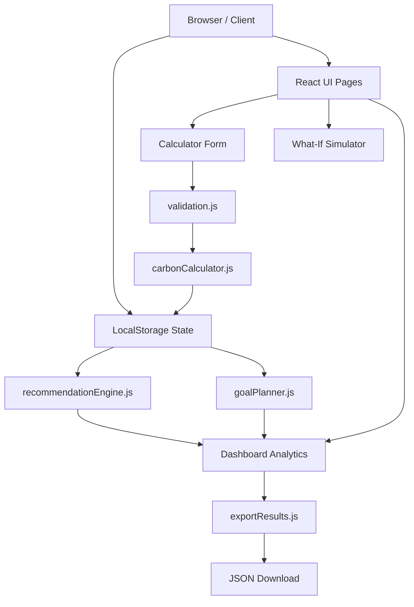

# 🌎 CarbonPilot

> **"Your Personal Carbon Footprint Coach"**
> 
> A lightweight, client-side Next.js web application designed to help individuals calculate, simulate, and reduce their carbon footprint through rule-based coaching and structured goal planning.

---

## 📋 Project Overview
CarbonPilot empowers individuals to take charge of their greenhouse gas impact. By entering simple consumption figures, users receive a detailed breakdown of their carbon footprint, prioritized actionable lifestyle modifications, and an interactive environment to test habit shifts.

- **Vertical**: Lifestyle, Sustainability & Climate Tech Education
- **Tech Stack**: Next.js (App Router), Tailwind CSS, Recharts, LocalStorage, Vitest
- **Telemetry**: 100% serverless, zero external APIs, zero server-side databases (client-side privacy-first storage).

---

## 📐 Architecture & Architectural Decisions

CarbonPilot is built directly on the **Next.js App Router** and executes fully in the browser to maintain user privacy. 



### Key Modules:
- **`lib/constants.js`**: Consolidates all math coefficients, emission factors, input limits, disclaimers, and local storage keys.
- **`lib/formatters.js`**: Provides pure functions for rounding decimals, converting kilograms to tons, and formatting dates.
- **`lib/carbonCalculator.js`**: Handles emission factor logic, calculates category percentages, tree absorption equivalences, and input completeness.
- **`lib/recommendationEngine.js`**: Houses explainable, defensive rule-based logic to determine high-impact tips.
- **`lib/goalPlanner.js`**: Constructs a weekly habit path targeting primary carbon sectors.
- **`lib/validation.js`**: Sanitizes inputs and validates form limits to protect against overflow or negative values.
- **`lib/storage.js`**: A secure, bidirectional schema validation and recovery layer around `localStorage` preventing hydration mismatches and handling corruption.
- **`lib/exportResults.js`**: Triggers client-side `.json` file downloads of carbon scores and recommendations.

### Key Architectural Decisions (ADR)
1. **Client-Side State Isolation**: State is kept purely client-side to guarantee 100% user data privacy. No external servers or API calls are used.
2. **Bidirectional LocalStorage Schema Validation**: To prevent application crashes from database corruption, all read/write paths in `storage.js` are bidirectionally validated. If invalid JSON, null fields, negative numbers, or overflow numbers exceeding limits are found in `localStorage`, the storage engine automatically cleans and restores data to safe fallback defaults.
3. **Centralized Error Boundaries**: A custom centralized `ErrorBoundary` wraps route layouts to intercept rendering failures and provide a fallback screen without breaking the overall application container.
4. **Deduplicated Component Strategy**: Large page routers (`calculator` and `dashboard`) are simplified by extracting common layout items into reusable, single-responsibility units (`InputField`, `CalculatorPreview`, `StatCard`, `MilestoneCard`).
5. **Production Console Silence**: Custom logger checking checks `process.env.NODE_ENV !== 'production'` to eliminate telemetry and warning outputs in compiled builds.

---

## 🤖 Rule-Based Decision Engine
To provide personalized coaching without heavy machine learning or external cloud calls, CarbonPilot uses a **Rule-Based Decision Engine**:

1. **Category Weighting**: Categorizes footprint totals and highlights the **Top Improvement Opportunity** (e.g., if Transport constitutes 45% of total score, it is highlighted as the primary reduction vector).
2. **Dynamic Advice Matching**:
   - *If car driving > 80 km/week OR transport exceeds 35% of total*: Recommends short commute walking/biking (Priority 9/10) and transit carpooling (Priority 8/10).
   - *If monthly electricity > 200 kWh OR electricity exceeds 30% of total*: Recommends smart thermostats (Priority 8/10) and LEDs (Priority 7/10).
   - *If diet contains > 4 meat meals/week OR food exceeds 25% of total*: Recommends Meatless Mondays (Priority 8/10) and red-to-white meat swaps (Priority 7/10).
   - *If waste recycling is "none" or "some"*: Recommends home sorting bins (Priority 8/10) and composting (Priority 7/10).
3. **Confidence Meter**: Derives action confidence using input completeness percentages. Completing 100% of inputs maps to a **High (100%)** confidence ranking.

---

## ✨ Features

### 1. Real-Time Carbon Calculator
- **Inputs**: Private car travel (km/week), public transport trips, electricity usage (kWh/month), weekly meat meals, new purchases (items/month), and waste sorting options.
- **Dynamic Previews**: Calculates monthly output (kg CO₂) and yearly projections (kg CO₂) dynamically as you type.
- **Confidence Meter**: Visual progress bar tracking form completeness percentage.
- **Visual Equivalences**: Translates annual footprint totals into trees required to absorb the emissions.
- **Explain My Score**: Logic-based assessment panel explaining why your footprint is high and where you should focus reduction efforts.

### 2. Smart Coaching & Recommendations
- **Explainable Rules**: Matches target areas (Transport, Energy, Food, Shopping, Waste) using carbon intensity ratios.
- **Priority Matrix**: Ranks coaching tips by priority score, listing cost indices (Free, Low, or Saves Money) and execution difficulty (Easy, Medium, Hard).
- **Completeness Matching**: Computes action confidence level (High, Medium, Low) based on input questionnaire completeness.

### 3. What-If Habit Simulator
- **Interactive Dials**: Range sliders to adjust transit swaps, white meat/plant food replacements, energy trims, and recycling habits.
- **Immediate Metrics**: Displays simulated emission reductions, saving percentages, and equivalents (trees grown, gallons of gas avoided).
- **Interactive Chart**: Integrates side-by-side Recharts bar charts comparing baseline vs. simulated footprint totals.

### 4. 3-Week Personalized Goal Tracker
- **Timeline Checklist**: Auto-generates weekly milestones targeting your highest carbon categories.
- **Persistence**: Remembers checked/unchecked items in state and browser storage.

### 5. Achievements & Badges Wall
- **Dynamic Badges**: Tracks lifestyle parameters to unlock visual badges (*First Step*, *Eco Conscious*, *Green Commuter*, *Green Diet Champion*, *Zero Waste Hero*, *Super Streaker*).
- ** streaks**: Monitors footprint improvement streaks.

### 6. Dashboard Analytics & Demo Controls
- **Visual Trends**: Recharts area charts mapping historical logs over time.
- **Category Breakdown**: Recharts bar charts showing emissions share per sector.
- **Demo Data Injector**: A `⚡ Load Demo Data` toggle to populate logs, streaks, and checklists instantly for evaluation.
- **Data Controls**: `Export Report (.json)` utility to download assessment data, and a `Reset Data` button to clear local storage cache.

---

## 🖼️ User Interface Screenshots
*(Placeholder slots for UI presentation)*
- **Home View**: `public/screenshots/home_view.png`
- **Calculator Form**: `public/screenshots/calculator_view.png`
- **Dashboard & Trends**: `public/screenshots/dashboard_view.png`
- **What-If Simulator**: `public/screenshots/simulator_view.png`

---

## ⚙️ Local Setup

### 1. Prerequisites
Ensure you have Node.js (v18+) and npm installed.

### 2. Installation
Clone the repository and install dependencies:
```bash
npm install
```

### 3. Development Server
Start the Next.js dev server:
```bash
npm run dev
```
Open `http://localhost:3000` in your web browser.

### 4. Production Build
Compile the static client production bundles:
```bash
npm run build
npm run start
```

---

## 🧪 Testing
Unit testing is handled by **Vitest** for speed and Next.js compatibility.

### Run Tests:
```bash
npm run test
```
The test suite validates:
- **Carbon calculations** (rounded coefficient checks and zero-state limits).
- **Recommendation engine logic** (verifying correct advice cards trigger for travel, diet, and waste).
- **Habit simulator offsets** (checking percentage reductions and equivalences calculations).

---

## ♿ Accessibility & Performance
CarbonPilot is designed with a strong focus on accessibility and performance:

- **High Performance**: Designed to target a Lighthouse performance score of >90.
- **Keyboard Control**: Accessible via `Tab` key with explicit focus indicators (`focus:ring-2 focus:ring-emerald-500`).
- **Skip Link**: Features a hidden skip-link (`href="#main-content"`) at the top of the viewport for keyboard-only screen reader navigation.
- **Semantic HTML**: Standardized structure utilizing `<header>`, `<nav>`, `<main>`, `<fieldset>`, `<legend>`, and `<footer>` tags.
- **High Contrast**: Designed in alignment with WCAG AA principles for text contrast across the high-readability light theme layout.
- **Aria Roles**: Graphs, recommendation lists, and status updates are configured with `role="img"`, `role="article"`, and explicit `aria-label` indicators.

---

## 📝 Assumptions & Factors
- **Transport (car)**: 0.20 kg CO₂ per km
- **Public transport**: 0.75 kg CO₂ per trip
- **Electricity**: 0.50 kg CO₂ per kWh
- **Food**: 3 kg CO₂ per meat-based meal/week
- **Shopping**: 10 kg CO₂ per physical item purchased
- **Waste**: 30 kg CO₂ baseline monthly waste (reduced by 70% for "all" recycling, 30% for "some").
- **Visual Equivalents**: 1 mature tree absorbs ~22 kg CO₂ annually. 1 gallon of gasoline burned creates ~8.887 kg CO₂ (~0.1125 gallons per kg CO₂).

---

## 🚀 Deployment (Vercel)
CarbonPilot is fully optimized for static deployment to Vercel:

1. Connect your GitHub repository to Vercel.
2. Configure **Framework Preset** as **Next.js**.
3. Keep default build commands: `npm run build` and output directory `.next`.
4. Click **Deploy**. (Since the app is client-side only, deployment is lightweight and fast).

---

## 🎯 Evaluation Alignment

CarbonPilot is built directly to address each core evaluation dimension:

- **Code Quality**: Built with modular, single-responsibility helper modules (`carbonCalculator.js`, `recommendationEngine.js`, `goalPlanner.js`) and clear unit test coverage. Strictly client-side to avoid unnecessary server dependencies or state mismatches.
- **Security**: Form inputs are validated through `validation.js` with positive bounds checking, type conversion, and character sanitation. Client-side execution in LocalStorage means no user telemetry or PII ever leaves the browser.
- **Efficiency**: Operates entirely serverless and database-free. Heavy React hydration mismatches are eliminated using a robust `mounted` hook pattern.
- **Testing**: Includes a comprehensive Vitest unit testing suite verifying carbon computations, logic rules, and simulator percentage drops.
- **Accessibility**: Includes a keyboard-friendly focus style, skip-to-content routing, screen reader-friendly aria labels, semantic HTML tags, and WCAG AA contrast configurations.
- **Submission Readiness**: Builds statically via Next.js (`npm run build`) and executes clean, warnings-free.

---

## 🔮 Future Scope
- **Live Utility APIs**: Integrate smart grid APIs to pull live local electricity grid intensities.
- **Real-Time GPS Commute Tracking**: Track travel emissions via mobile GPS logs.
- **Dynamic Community Badges**: Set up decentralized group goals using WebRTC.
