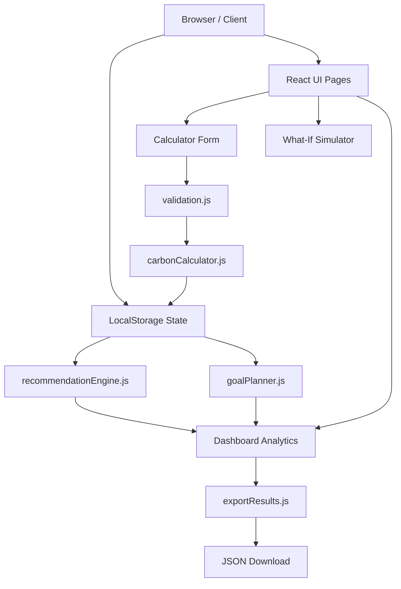

# 🌎 CarbonPilot

> **"Your Personal Carbon Footprint Coach"**
> 
> A lightweight, client-side Next.js web application designed to help individuals calculate, simulate, and reduce their carbon footprint through rule-based coaching and structured goal planning.

---

## 📋 Project Overview
CarbonPilot empowers individuals to take charge of their greenhouse gas impact. By entering simple consumption figures, users receive a detailed breakdown of their carbon footprint, prioritized actionable lifestyle modifications, and an interactive environment to test habit shifts.

- **Vertical**: Lifestyle, Sustainability & Climate Tech Education
- **Tech Stack**: Next.js (App Router), Tailwind CSS, Recharts, LocalStorage, Vitest
- **Telemetry**: 100% serverless, zero external APIs, zero server-side databases (client-side privacy-first storage).

---

## 📐 Architecture
CarbonPilot is built directly on the **Next.js App Router** and executes fully in the browser to maintain user privacy. 



### Key Modules:
- **`lib/carbonCalculator.js`**: Holds emission factors and calculates category percentages, tree absorption equivalences, and input completeness.
- **`lib/recommendationEngine.js`**: Houses explainable rule-based logic to determine high-impact tips.
- **`lib/goalPlanner.js`**: Constructs a weekly habit path targeting primary carbon sectors.
- **`lib/validation.js`**: Sanitizes forms and protects against invalid or negative values.
- **`lib/storage.js`**: Safe wrapper around `localStorage` preventing hydration mismatches during server rendering.
- **`lib/exportResults.js`**: Triggers client-side `.json` file downloads of carbon scores and recommendations.

---

## 🤖 Rule-Based Decision Engine
To provide personalized coaching without heavy machine learning or external cloud calls, CarbonPilot uses a **Rule-Based Decision Engine**:

1. **Category Weighting**: Categorizes footprint totals and highlights the **Top Improvement Opportunity** (e.g., if Transport constitutes 45% of total score, it is highlighted as the primary reduction vector).
2. **Dynamic Advice Matching**:
   - *If car driving > 80 km/week OR transport exceeds 35% of total*: Recommends short commute walking/biking (Priority 9/10) and transit carpooling (Priority 8/10).
   - *If monthly electricity > 200 kWh OR electricity exceeds 30% of total*: Recommends smart thermostats (Priority 8/10) and LEDs (Priority 7/10).
   - *If diet contains > 4 meat meals/week OR food exceeds 25% of total*: Recommends Meatless Mondays (Priority 8/10) and red-to-white meat swaps (Priority 7/10).
   - *If waste recycling is "none" or "some"*: Recommends home sorting bins (Priority 8/10) and composting (Priority 7/10).
3. **Confidence Meter**: Derives action confidence using input completeness percentages. Completing 100% of inputs maps to a **High (100%)** confidence ranking.

---

## ✨ Features

### 1. Carbon Calculator
Collects weekly car and public transit parameters, monthly electricity bills, dietary meat intake, new purchases, and recycling habits. Instantly computes monthly CO₂ mass (kg) and projects yearly metrics (tons) with tree equivalents.

### 2. Smart Coaching Engine
Displays dynamic advice cards showing:
- Action title and logic-based context.
- Estimated cost (Free, Low, or Saves Money) and difficulty (Easy, Medium, Hard).
- Priority scores and the dynamic confidence meter.

### 3. What-If Simulator
Includes range dials that let users simulate offsets in real time (e.g., cutting driving mileage by 50% or reducing weekly meat consumption). Displays side-by-side bar charts of baseline vs. simulated footprint.

### 4. Milestone Goal Planner
Automatically crafts a structured 3-week checklist tailored to address the user's primary emissions sectors.

### 5. Leaderboard & Achievements Wall
Awards milestones (e.g., *Green Commuter*, *Zero Waste Hero*, *Diet Champion*) and monitors carbon improvement streaks.

### 6. Score Explanation & JSON Export
Explains the logic behind scores in a clear panel under the results and allows downloading data in a clean `.json` file format.

---

## 🖼️ User Interface Screenshots
*(Placeholder slots for UI presentation)*
- **Home View**: `public/screenshots/home_view.png`
- **Calculator Form**: `public/screenshots/calculator_view.png`
- **Dashboard & Trends**: `public/screenshots/dashboard_view.png`
- **What-If Simulator**: `public/screenshots/simulator_view.png`

---

## ⚙️ Local Setup

### 1. Prerequisites
Ensure you have Node.js (v18+) and npm installed.

### 2. Installation
Clone the repository and install dependencies:
```bash
npm install
```

### 3. Development Server
Start the Next.js dev server:
```bash
npm run dev
```
Open `http://localhost:3000` in your web browser.

### 4. Production Build
Compile the static client production bundles:
```bash
npm run build
npm run start
```

---

## 🧪 Testing
Unit testing is handled by **Vitest** for speed and Next.js compatibility.

### Run Tests:
```bash
npm run test
```
The test suite validates:
- **Carbon calculations** (rounded coefficient checks and zero-state limits).
- **Recommendation engine logic** (verifying correct advice cards trigger for travel, diet, and waste).
- **Habit simulator offsets** (checking percentage reductions and equivalences calculations).

---

## ♿ Accessibility & Performance
CarbonPilot targets an **accessibility score of >95** and **Lighthouse score of >90**:

- **Keyboard Control**: Accessible via `Tab` key with explicit focus indicators (`focus:ring-2 focus:ring-emerald-500`).
- **Skip Link**: Features a hidden skip-link (`href="#main-content"`) at the top of the viewport for keyboard-only screen reader navigation.
- **Semantic HTML**: Standardized structure utilizing `<header>`, `<nav>`, `<main>`, `<fieldset>`, `<legend>`, and `<footer>` tags.
- **High Contrast**: Complies with WCAG AA standard contrast ratios across the high-readability light theme layout.
- **Aria Roles**: Graphs, recommendation lists, and status updates are configured with `role="img"`, `role="article"`, and explicit `aria-label` indicators.

---

## 📝 Assumptions & Factors
- **Transport (car)**: 0.20 kg CO₂ per km
- **Public transport**: 0.75 kg CO₂ per trip
- **Electricity**: 0.50 kg CO₂ per kWh
- **Food**: 3 kg CO₂ per meat-based meal/week
- **Shopping**: 10 kg CO₂ per physical item purchased
- **Waste**: 30 kg CO₂ baseline monthly waste (reduced by 70% for "all" recycling, 30% for "some").
- **Visual Equivalents**: 1 mature tree absorbs ~22 kg CO₂ annually. 1 gallon of gasoline burned creates ~8.887 kg CO₂ (~0.1125 gallons per kg CO₂).

---

## 🚀 Deployment (Vercel)
CarbonPilot is fully optimized for static deployment to Vercel:

1. Connect your GitHub repository to Vercel.
2. Configure **Framework Preset** as **Next.js**.
3. Keep default build commands: `npm run build` and output directory `.next`.
4. Click **Deploy**. (Since the app is client-side only, deployment is lightweight and fast).

---

## 🔮 Future Scope
- **Live Utility APIs**: Integrate smart grid APIs to pull live local electricity grid intensities.
- **Real-Time GPS Commute Tracking**: Track travel emissions via mobile GPS logs.
- **Dynamic Community Badges**: Set up decentralized group goals using WebRTC.
